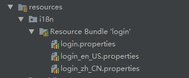

## 页面国际化
1）编写国际化配置文件，抽取页面需要显示的国际化消息


2）application.properties中指定配置文件
```properties
spring.messages.basename=i18n.login
```
3）thymeleaf页面中用#{}取出国际化内容

## 点击不同语言切换相应语言
1) 编写LocaleResolver
```java
public class MyLocaleResolver implements LocaleResolver {
    
    @Override
    public Locale resolveLocale(HttpServletRequest request) {
        String l = request.getParameter("l");
        Locale locale = Locale.getDefault();
        if(!StringUtils.isEmpty(l)){
            String[] split = l.split("_");
            locale = new Locale(split[0],split[1]);
        }
        return locale;
    }

    @Override
    public void setLocale(HttpServletRequest request, HttpServletResponse response, Locale locale) {

    }
}
```
2) 自定义的mvc配置
```java
@Configuration
public class MyMvcConfig implements WebMvcConfigurer{
  
    @Bean
    public LocaleResolver localeResolver(){

        return new MyLocaleResolver();
    }

}

```

3) 页面上切换链接更改请求语言
```html
<a class="btn btn-sm" th:href="@{/index.html(l='zh_CN')}">中文</a>
<a class="btn btn-sm" th:href="@{/index.html(l='en_US')}">English</a>
```


